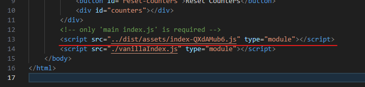

# Test React Embedding

This project is a test of embedding a React component in a vanilla JS website.

*Inspiration: https://www.learningsomethingnew.com/embed-react-in-vanilla-js-website*

## Features

- append a React component to a DOM element
- get and set state of React component
- lazy export of React component
- support for TypeScript and JavaScript with `@ts-check`
- export CSS

## Testing

Open [vanilla-website/index.html](vanilla-website/index.html) in a browser.

*Note: the folder [dist](dist) is not ignored by git so that no need to build before testing.*

## Installation

```bash
npm install
npm run build
```

You will have something like this:


Update the path in [vanilla-website/index.html](vanilla-website/index.html) to the built file like this:



## Some info

- `ReactDOM` require a root element. In order to not lose the children of the element, a `span` is created and used as root.
- the library [vite-plugin-dts](https://github.com/qmhc/vite-plugin-dts) is used to generate the `.d.ts` file.

## Example


<details>
<summary>Show React Code</summary>

Content of [src/Counter.tsx](src/Counter.tsx):

```ts
import React, { useState } from "react";

export type CounterProps = { count: number; setCount: (count: number) => void; onCountChange?: (count: number) => void };

export const Counter = (props: { state: CounterProps }) => {
	const [count, setCount] = useState(0);
	React.useEffect(() => {
		props.state.count = count;
		props.state.setCount = setCount;
		props.state.onCountChange?.(count);
	}, [props.state, count]);
	return <button onClick={() => setCount(count + 1)}>count is {count}</button>;
};
```

Content of [src/ColorText.tsx](src/ColorText.tsx):

```ts
import React, { useState } from "react";

export type ColorTextProps = { text: string; setText: (text: string) => void; onTextChange?: (text: string) => void };

export const ColorText = (props: { state: ColorTextProps }) => {
	const [text, setText] = useState("");
	React.useEffect(() => {
		props.state.text = text;
		props.state.setText = setText;
		props.state.onTextChange?.(text);
	}, [props.state, text]);
	return <input style={{ color: text }} type="text" value={text} onChange={(e) => setText(e.target.value)} />;
};
```

Content of [src/main.tsx](src/main.tsx):

```ts
import React from "react";
import ReactDOM from "react-dom/client";
import "./index.css";
import { Counter, CounterProps } from "./Counter";
import { ColorTextProps } from "./ColorText";

declare global {
	interface Window {
		appendCounter: (el: HTMLElement) => CounterProps;
		textComponent: () => { el: HTMLElement; st: ColorTextProps };
	}
}

window.appendCounter = (el: HTMLElement) => {
	// uncomment for lazy loading
	// const Counter = React.lazy(() => import("./Counter").then((module) => ({ default: module.Counter })));
	const child = document.createElement("span");
	const root = ReactDOM.createRoot(child);
	const state = {} as CounterProps; // state initialized in Counter
	root.render(
		<React.StrictMode>
			{/* React.Suspense now not needed since lazy loading is commented out */}
			<Counter state={state} />
		</React.StrictMode>
	);
	el.appendChild(child);
	return state;
};

window.textComponent = () => {
	const ColorText = React.lazy(() => import("./ColorText").then((module) => ({ default: module.ColorText })));
	const el = document.createElement("span");
	const st = {} as ColorTextProps; // state initialized in ColorText
	const root = ReactDOM.createRoot(el);
	root.render(
		<React.StrictMode>
			<React.Suspense>
				<ColorText state={st} />
			</React.Suspense>
		</React.StrictMode>
	);
	return { el, st };
};
```

</details>

Content of [vanilla-website/vanillaIndex.js](vanilla-website/vanillaIndex.js):

```js
// @ts-check

/* eslint-disable @typescript-eslint/triple-slash-reference */

/// <reference path="../dist/main.d.ts" />

// get functions defined in the react app
const { appendCounter, textComponent } = window;

// get html elements
const countersEl = document.getElementById("counters");
if (countersEl === null) throw new Error("counters element not found");
const addCounterButton = document.getElementById("add-counter");
if (addCounterButton === null) throw new Error("add-counter button not found");
const resetCountersButton = document.getElementById("reset-counters");
if (resetCountersButton === null) throw new Error("reset-counters button not found");

/** @type {import("../dist/Counter").CounterProps[]} */
const counterStates = [];

addCounterButton.addEventListener("click", () => counterStates.push(appendCounter(countersEl)));
resetCountersButton.addEventListener("click", () => counterStates.forEach((counterState) => counterState.setCount(0)));

// add sample counter
counterStates.push(appendCounter(countersEl));

// add sample text component
const { st, el } = textComponent();
document.body.appendChild(el);
const text = document.createTextNode("");
document.body.appendChild(text);
st.onTextChange = (newText) => (text.nodeValue = newText); // update text node when text changes
```
